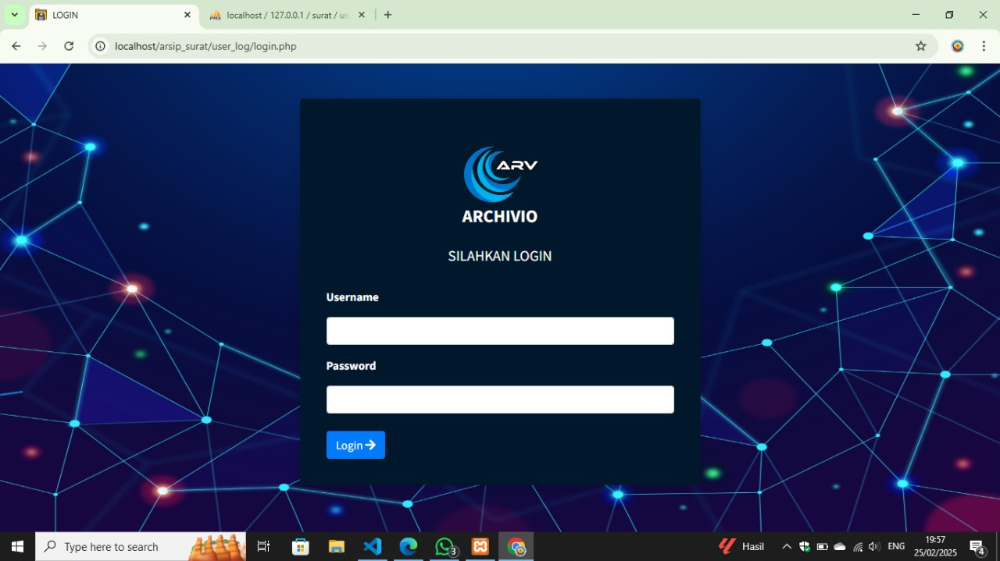
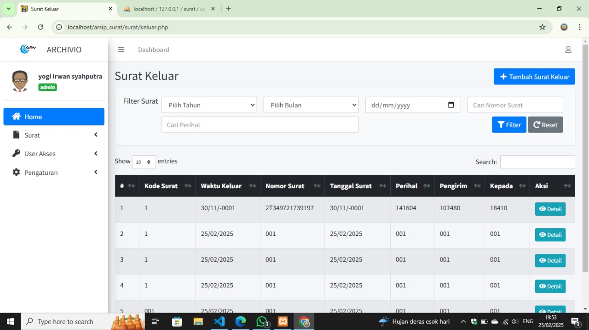

# Archivio



**Archivio** adalah aplikasi berbasis web yang digunakan untuk menyimpan dan mengelola dokumen-dokumen penting. Aplikasi ini dikembangkan oleh mahasiswa **STMIK Pelita Nusantara** dalam rangka **Praktik Kerja (PK)**.

## 🚀 Fitur Utama

- 🔐 **Login & Manajemen Pengguna** (Terdapat 2 role berbeda)
- 📩 **Manajemen Surat Masuk** (Tambah, edit, hapus, dan cari surat masuk)
- 📤 **Manajemen Surat Keluar** (Tambah, edit, hapus, dan cari surat keluar)
- 📊 **Dashboard Statistik** (Menampilkan ringkasan data surat)
- 🎨 **UI Modern** dengan AdminLTE & Bootstrap
- ⚡ **Notifikasi SweetAlert2**

## 🛠️ Teknologi yang Digunakan

- **Backend:** PHP Native
- **Database:** MySQL
- **Frontend:** HTML, CSS, JavaScript
- **Framework & Library:**
  - Bootstrap 4.6.0
  - AdminLTE
  - jQuery 3.6.0
  - FontAwesome 5.15.3
  - SweetAlert2 11.4.6

## 📸 Tampilan Antarmuka



## 📥 Instalasi & Penggunaan

1. **Clone Repository:**
   ```sh
   git clone https://github.com/username/archivio.git
   ```
2. **Import Database:**
   - Buat database di MySQL
   - Import file `surat.sql` yang ada di dalam folder `db`
3. **Konfigurasi Koneksi Database:**
   - Buka file `connection\connection.php`
   - Sesuaikan dengan kredensial database Anda
4. **Jalankan di Localhost:**
   ```sh
   php -S localhost:8000
   ```
   atau gunakan XAMPP

---

✨ **Dikembangkan oleh Mahasiswa STMIK Pelita Nusantara** ✨
